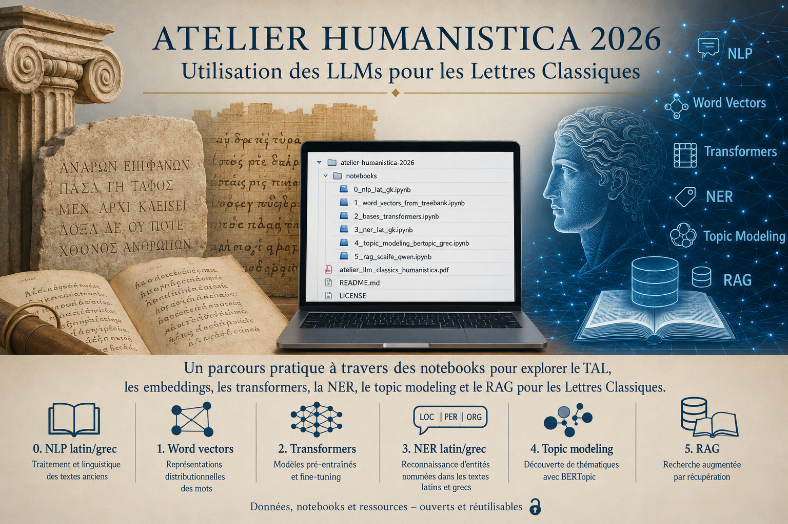

# Atelier Humanistica 2026 — TAL, IA et lettres classiques

Ce dépôt rassemble les carnets Python utilisés pour un atelier Humanistica 2026 consacré aux usages du traitement automatique des langues (TAL), des modèles de langue et des méthodes d'intelligence artificielle pour les textes anciens, principalement en latin et en grec ancien.

L'objectif est pédagogique : proposer des notebooks exécutables, modifiables et réutilisables pour explorer progressivement plusieurs tâches courantes en humanités numériques classiques : prétraitement linguistique, vectorisation, classification, reconnaissance d'entités nommées, topic modeling et RAG.

## Contenu du dépôt

| Notebook | Thème | Objectif principal | Ouvrir dans Colab |
|---|---|---|---|
| `0_nlp_lat_gk.ipynb` | Prétraitement TAL latin/grec | Tokeniser, lemmatiser et étiqueter morphosyntaxiquement des textes latins et grecs avec `stanza`, puis comparer formes, lemmes et listes filtrées | [Colab](https://colab.research.google.com/github/OdysseusPolymetis/atelier_humanistica2026/blob/main/0_nlp_lat_gk.ipynb) |
| `1_word_vectors_from_treebank.ipynb` | Vecteurs de mots statiques | Construire un modèle `Word2Vec` à partir de textes lemmatisés issus des treebanks Perseus | [Colab](https://colab.research.google.com/github/OdysseusPolymetis/atelier_humanistica2026/blob/main/1_word_vectors_from_treebank.ipynb) |
| `2_bases_transformers.ipynb` | Premiers exemples avec Transformers | Tester quelques pipelines simples de `transformers` : classification zéro-shot, fill-mask, NER, question answering, résumé et traduction | [Colab](https://colab.research.google.com/github/OdysseusPolymetis/atelier_humanistica2026/blob/main/2_bases_transformers.ipynb) |
| `3_ner_lat_gk.ipynb` | Reconnaissance d'entités nommées | Comparer des modèles NER pour le grec ancien et le latin, puis appliquer l'extraction d'entités à des textes plus longs | [Colab](https://colab.research.google.com/github/OdysseusPolymetis/atelier_humanistica2026/blob/main/3_ner_lat_gk.ipynb) |
| `4_topic_modeling_bertopic_grec.ipynb` | Topic modeling grec ancien | Construire un corpus grec, produire des embeddings, réduire l'espace vectoriel avec UMAP, regrouper les passages avec HDBSCAN et interpréter les topics avec BERTopic | [Colab](https://colab.research.google.com/github/OdysseusPolymetis/atelier_humanistica2026/blob/main/4_topic_modeling_bertopic_grec.ipynb) |
| `5_rag_scaife_qwen.ipynb` | RAG grec ancien-français | Construire un pipeline de retrieval sur corpus grec et générer une réponse en français avec Qwen à partir de passages cités | [Colab](https://colab.research.google.com/github/OdysseusPolymetis/atelier_humanistica2026/blob/main/5_rag_scaife_qwen.ipynb) |

Le fichier `atelier_llm_classics_humanistica.pdf` contient le support de présentation associé à l'atelier.

## Progression proposée

Les notebooks peuvent être utilisés indépendamment, mais ils suivent une progression logique :

1. **Préparer les textes** : tokenisation, lemmatisation, étiquetage grammatical et suppression des mots outils.
2. **Représenter les mots** : apprentissage de vecteurs de mots statiques avec `Word2Vec`.
3. **Comprendre les Transformers** : démonstrations simples de tâches génériques avec la bibliothèque `transformers`.
4. **Extraire des entités nommées** : détection de personnes, lieux et entités diverses dans des textes anciens.
5. **Explorer des thèmes** : topic modeling non supervisé avec BERTopic sur des passages grecs.
6. **Interroger un corpus** : retrieval augmenté par génération, avec comparaison de plusieurs stratégies de recherche et réponse finale produite par Qwen.

## Exécution

### Option recommandée : Google Colab

Les carnets sont conçus pour être exécutés facilement dans Google Colab. Il suffit d'ouvrir le notebook voulu avec le lien Colab correspondant dans le tableau ci-dessus, puis d'exécuter les cellules dans l'ordre.

Pour les notebooks les plus lourds (`3_ner_lat_gk.ipynb`, `4_topic_modeling_bertopic_grec.ipynb`, `5_rag_scaife_qwen.ipynb`), il est préférable d'activer un GPU dans Colab :

```text
Exécution > Modifier le type d'exécution > GPU T4
```

### Option locale

Il est aussi possible de cloner le dépôt et d'exécuter les carnets localement :

```bash
git clone https://github.com/OdysseusPolymetis/atelier_humanistica2026.git
cd atelier_humanistica2026
jupyter lab
```

Les dépendances sont installées directement dans les notebooks au moyen de cellules `pip install`. Selon le carnet utilisé, les bibliothèques principales sont notamment :

- `stanza`
- `gensim`
- `transformers`
- `sentence-transformers`
- `flair`
- `bertopic`
- `umap-learn`
- `hdbscan`
- `faiss-cpu`
- `pandas`, `numpy`, `scikit-learn`, `matplotlib`, `plotly`

## Données utilisées

Les carnets récupèrent automatiquement plusieurs ressources ouvertes au moment de l'exécution, par exemple :

- textes et treebanks Perseus ;
- textes TEI XML issus de dépôts GitHub comme `PerseusDL/canonical-greekLit` ou `OpenGreekAndLatin/First1KGreek` ;
- listes de mots outils pour le grec et le latin ;
- modèles pré-entraînés disponibles via Hugging Face.

Pour le notebook `5_rag_scaife_qwen.ipynb`, un fichier de paires alignées grec-français est attendu par défaut sous le nom :

```text
train.csv
```

Ce fichier doit contenir au minimum deux colonnes :

```text
greek,french
```

Il sert de pont bilingue pour comparer plusieurs stratégies de recherche entre une question française et un corpus grec.

## Remarques pédagogiques

Ces notebooks sont pensés pour un atelier d'initiation et d'expérimentation. Ils ne visent pas à fournir des pipelines définitifs ou entièrement optimisés, mais plutôt à montrer concrètement :

- ce que produisent les outils de TAL sur des langues anciennes ;
- pourquoi le prétraitement linguistique reste important ;
- comment les représentations vectorielles permettent de rapprocher formes, mots, passages ou textes ;
- comment les modèles multilingues peuvent être mobilisés pour des corpus latins et grecs ;
- quelles limites subsistent : erreurs d'annotation, bruit dans les entités nommées, dépendance aux données d'entraînement, coût computationnel, interprétabilité des résultats.

## Licence

Ce dépôt est distribué sous licence **GNU GPL v3**. Voir le fichier `LICENSE` pour le texte complet.

## Citation

Si vous réutilisez ces carnets dans un cours, un atelier ou un projet de recherche, vous pouvez citer le dépôt sous la forme :

```text
Atelier Humanistica 2026 — TAL, IA et lettres classiques.
OdysseusPolymetis, GitHub, 2026.
https://github.com/OdysseusPolymetis/atelier_humanistica2026
```
